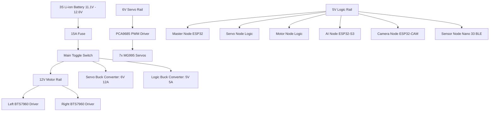

# Power Distribution Architecture

## Purpose
This document details the power regulation layout, safety systems, and grounding strategies for the PRAYAS V1 robot.

## Power Architecture Diagram

---

## Power Rails Specification

### 1. 12.0V Motor Rail
*   **Source**: Battery output (11.1V nominal, 12.6V max).
*   **Load**: 4 × Johnson 12V 200RPM Geared Motors via 2 × BTS7960 drivers.
*   **Current Limit**: 10A peak during acceleration.

### 2. 6.0V Servo Rail
*   **Source**: Step-down buck regulator.
*   **Load**: 7 × TowerPro MG995 Analog Metal Gear Servos.
*   **Current Limit**: 12A continuous, 15A peak.
*   **Design Note**: Servos operate at 6.0V to maximize torque (10.0 kg·cm) and speed (0.16s/60°).

### 3. 5.0V Logic Rail
*   **Source**: Step-down buck regulator.
*   **Load**: Microcontrollers, I2C pullups, Camera, and Sensors.
*   **Current Limit**: 5A continuous.

---

## Grounding Strategy (Star Grounding)
High current drawn by the motors can cause voltage shifts along ground traces, leading to microcontroller resets. PRAYAS uses a **Star Grounding Scheme**:
*   All low-power logic grounds connect to a logic ground copper plane on the power distribution board.
*   High-power grounds (from motor drivers and the servo rail regulator) connect directly to the main battery negative terminal block.
*   A single connection connects the logic ground plane to the battery negative terminal to align reference levels while preventing ground loops.
