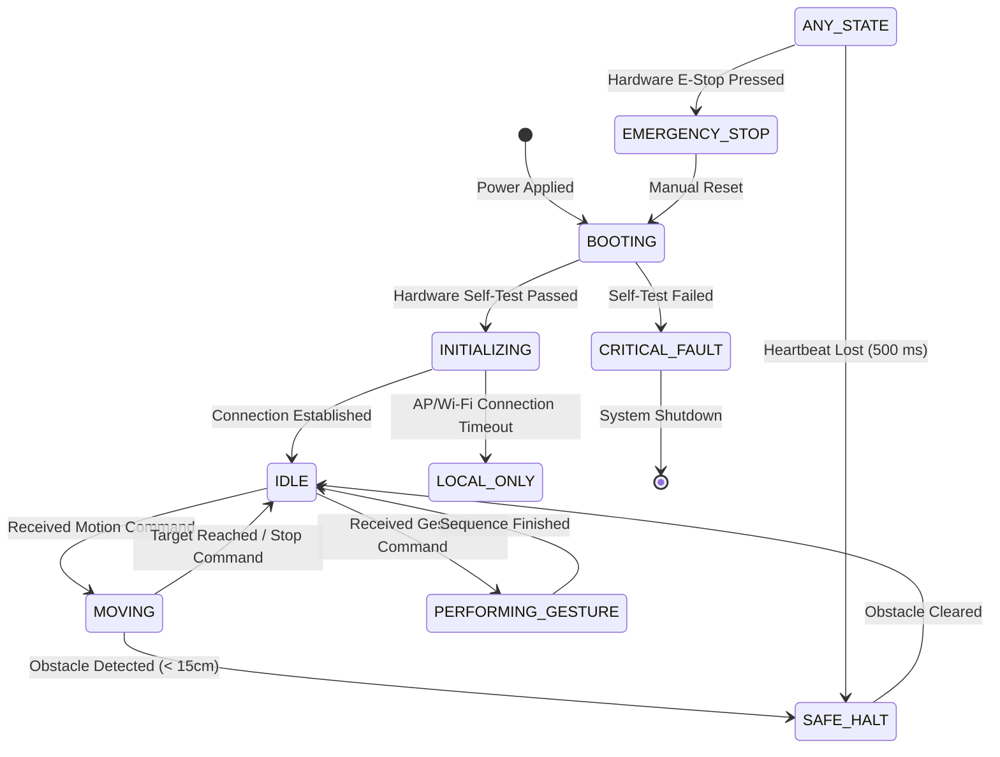

# Software & Systems Control Architecture

## Purpose
This document explains the software architecture of PRAYAS V1, outlining the state machine, task distribution, and inter-node scheduling.

## Software Architecture

---

## FreeRTOS Multi-Tasking Architecture
All ESP32 nodes run a custom firmware built on FreeRTOS. Tasks are scheduled across the two cores to isolate communication, sensor processing, and real-time motor control:

### Master Node Scheduling Model
*   **Core 0**:
    *   `vMQTTPoolingTask` (Priority 3, Stack size 4096 bytes): Processes network sockets, updates telemetry states, and parses incoming JSON messages.
    *   `vOTAUpdateTask` (Priority 1, Stack size 2048 bytes): Listens for remote firmware uploads.
*   **Core 1**:
    *   `vESPNOWRoutingTask` (Priority 5, Stack size 2048 bytes): Broadcasts controls and maps inputs from sub-nodes.
    *   `vDiagnosticsTask` (Priority 2, Stack size 2048 bytes): Monitors stack allocations and system health.

### Motor Node Scheduling Model
*   **Core 0**:
    *   `vESPNOWReceiveTask` (Priority 5, Stack size 2048 bytes): Decodes speed commands and updates the target velocity buffers.
*   **Core 1**:
    *   `vMotorPIDTask` (Priority 6, Stack size 4096 bytes): Runs the PID loop, reads sensor inputs, and controls the H-bridge drivers.
