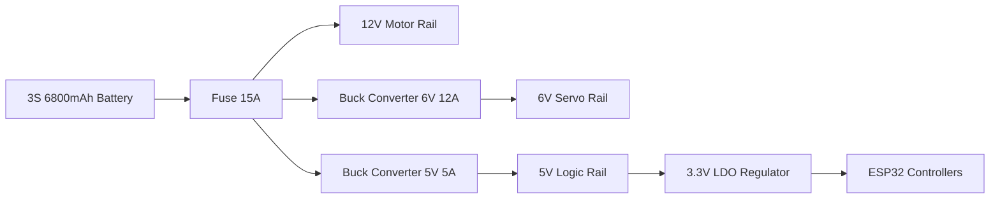

# System Architecture

## Purpose
This document provides a system-level description of PRAYAS V1, outlining the interconnected hardware nodes, their communication paths, and power routes.

## Overview
PRAYAS V1 uses a **Distributed ESP32 Node Architecture**. Rather than centralizing processing, tasks are divided among specialized nodes. The Master Node acts as the central coordinator, connecting to the cloud and dashboard via Wi-Fi/MQTT, and broadcasting commands to the sub-nodes (Motor, Servo, Sensor) using ESP-NOW.

## System Block Diagram

```mermaid
graph TD
    %% Controllers and Nodes
    subgraph Core Base
        Master[Master ESP32 Node]
        Motor[Motor ESP32 Node]
        Power[Power ESP32 Node]
        Sensor[Sensor Node: Arduino Nano]
    end

    subgraph Humanoid Torso
        Servo[Servo ESP32 Node]
        Camera[Camera ESP32-CAM Node]
        AI[AI ESP32-S3 Node]
    end

    %% External Systems
    Web[Web Dashboard]
    Broker[MQTT Broker on VPS]
    Gamepad[Gamepad Controller]

    %% Communication Links
    Master <-->|ESP-NOW| Motor
    Master <-->|ESP-NOW| Servo
    Master <-->|ESP-NOW| Sensor
    Master <-->|ESP-NOW| Power

    AI <-->|UART / MQTT| Master
    Camera <-->|WebSocket Stream| Web
    Gamepad <-->|Bluetooth/WebSocket| Web
    Web <-->|MQTT| Broker
    Master <-->|Wi-Fi / MQTT| Broker

    %% Device Connections
    Motor -->|PWM| Drivers[2x BTS7960 Drivers] -->|12V| Motors[4x Johnson Motors]
    Servo -->|I2C| PCA[PCA9685 PWM Driver] -->|6V| Servos[7x MG995 Servos]
    AI -->|Analog| Speaker[Speaker]
    AI <--|Analog| Mic[Microphone]
```

## Power Architecture Flow
The battery supplies power to three separate regulation rails to prevent electrical noise from the motors and servos from resetting the microcontrollers:



## Communication Layout
*   **Inter-Node Communications**: Low-latency, connectionless ESP-NOW packets (2.4 GHz).
*   **External Communications**: Wi-Fi 802.11 b/g/n, transmitting JSON messages over MQTT.
*   **Streaming**: TCP WebSockets used for the camera's JPEG video frames.
