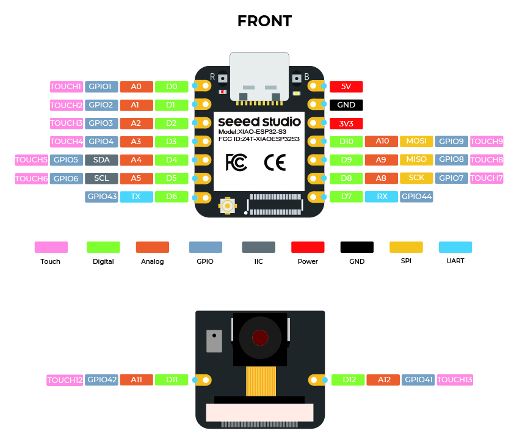

# AI & Voice Node

## Purpose
The AI Node processes voice interaction, handles conversational flows via the Xiaozhi framework, and interfaces with cloud LLM systems using the Model Context Protocol (MCP).

## Hardware Used
*   **MCU**: Seeed Studio XIAO ESP32-S3 Sense (Dual-core Xtensa 32-bit LX7, 240 MHz, 8MB PSRAM, 8MB Flash) — [Official Seeed Studio Product Details](https://www.seeedstudio.com/XIAO-ESP32S3-Sense-p-5639.html).
    
    { style="display: block; margin: 0 auto;" width="300" }

*   **Integrated Camera**: OV2640 Camera Module (plug-in board included with the XIAO Sense) used for local object detection, visual classifications, and general Q&A assistant tasks.
*   **Integrated Microphone**: On-board digital MSM261D3526H1CPM MEMS microphone (used for voice capture, although external I2S devices can be attached).
*   **DAC/Codec**: ES8311 I2S Audio Codec.
*   **Speaker**: 3W 8-Ohm Speaker.

> [!IMPORTANT]
> **Vision System Division of Labor**:
> PRAYAS V1 separates vision processing into two separate hardware pathways:
> 1.  **AI Node Camera (XIAO ESP32-S3 Sense)**: Processes raw image data locally or streams it to cloud endpoints for object recognition, face matching, visual Q&A, and cognitive spatial analysis.
> 2.  **Camera Node (ESP32-CAM)**: Dedicated entirely to serving a continuous JPEG WebSockets video stream to the Web Dashboard. This prevents cognitive AI vision queries from interrupting the real-time operator video feed.

## GPIO Mapping
| GPIO Pin | Pin Function | Target Component |
| :--- | :--- | :--- |
| **GPIO 1** | I2S Serial Data Out (SDOUT) | ES8311 DAC SDIN |
| **GPIO 2** | I2S Serial Clock (BCLK) | ES8311 / INMP441 BCLK |
| **GPIO 3** | I2S Word Select (LRCK) | ES8311 / INMP441 WS |
| **GPIO 4** | I2S Serial Data In (SDIN) | INMP441 SD Out |
| **GPIO 18**| UART Tx (To Master Rx2) | Master Node GPIO 16 |
| **GPIO 19**| UART Rx (To Master Tx2) | Master Node GPIO 17 |

## Speech Pipeline Block Diagram
```
  [ INMP441 Mic ] ──(I2S Digital)──> [ ESP32-S3 Node ]
                                            │
                                    (VAD & Wake Word)
                                            │ (Wi-Fi TCP)
                                            ▼
                                   [ Cloud TTS / LLM ]
                                            │ (Wi-Fi TCP)
                                            ▼
  [ ES8311 Codec ] <──(I2S Digital)── [ ESP32-S3 Node ]
          │
  [ 3W Speaker ]
```

## Failure Cases & Recovery
*   **High Speech Latency**: If the cloud response takes longer than 2.0 seconds, the AI Node plays a local audio response (e.g. "Processing command...") to update the user.
