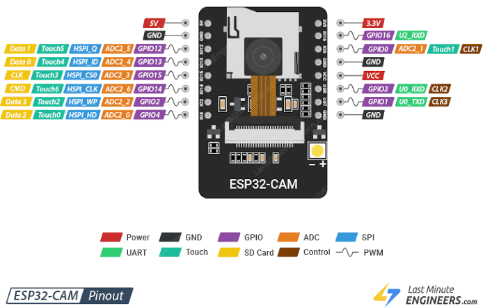

# Camera & Vision Node

## Purpose
The Camera Node captures video and serves a JPEG/WebSocket stream to the Web Dashboard. It can also perform basic computer vision tasks.

## Hardware Used
*   **MCU**: ESP32-CAM (AI-Thinker module board) — [AI-Thinker ESP32-CAM Pinout Reference](https://randomnerdtutorials.com/esp32-cam-ai-thinker-pinout/).
    
    { style="display: block; margin: 0 auto;" width="450" }

*   **Sensor**: OV2640 2-Megapixel CMOS camera module.
*   **Flash**: Built-in bright white LED (connected to GPIO 4).

## GPIO Mapping
*   **Camera Data Pins (Y2-Y9)**: GPIO 5, 18, 19, 21, 36, 39, 34, 35.
*   **VSYNC**: GPIO 25.
*   **HREF**: GPIO 26.
*   **PCLK**: GPIO 22.
*   **XCLK**: GPIO 0.
*   **SIOD (SDA)**: GPIO 26.
*   **SIOC (SCL)**: GPIO 27.
*   **Flash LED**: GPIO 4.

## Image Configurations
*   **Resolution**: Default set to SVGA (800x600) for WebSockets. Can drop to QVGA (320x240) if signal strength drops.
*   **JPEG Quality**: Compression factor set to 12 (scale of 10-63, lower is better quality).

## Limitations
*   **No Simultaneous Wi-Fi / Flash LED**: GPIO 4 is used for the flash LED and is also tied to one of the micro-SD card data lines. When using the SD card for logging, the flash LED may flicker, and high current draw from the LED can cause power spikes that reset the camera node.
