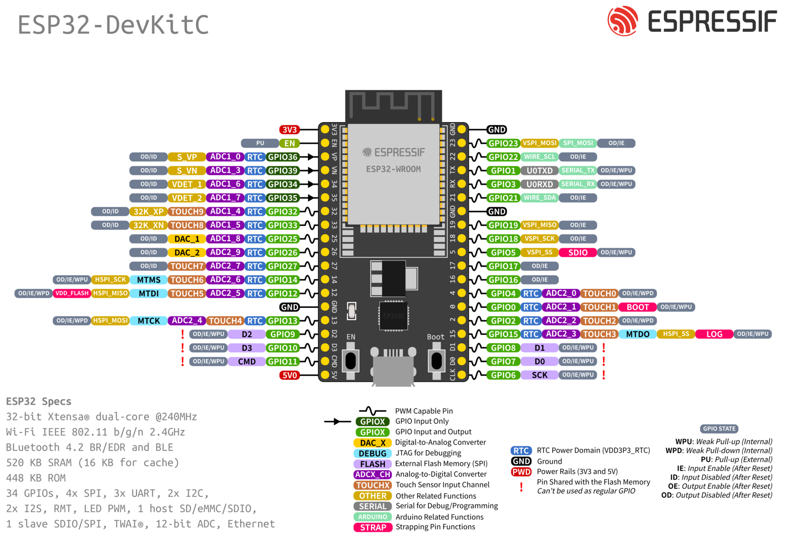
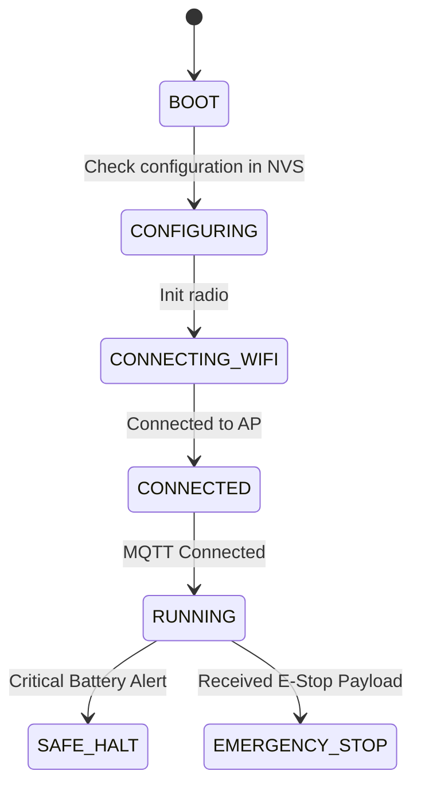

# Master Coordinator Node

## Purpose
The Master Coordinator Node serves as the brain of PRAYAS V1. It connects to external systems (MQTT broker, dashboard) over Wi-Fi and coordinates the sub-nodes (Motor, Servo, Sensor) using ESP-NOW.

## Hardware Used
*   **MCU**: ESP32-WROOM-32E (mounted on ESP32-DevKitC-v4 core board) — [Official Espressif Hardware Reference](https://docs.espressif.com/projects/esp-idf/en/v5.1/esp32/hw-reference/esp32/get-started-devkitc.html).
    
    

*   **Antenna**: Built-in PCB trace antenna (an external u.FL antenna version is recommended if inside a metal shield).

## GPIO Mapping
*   **GPIO 16**: Rx2 (Connected to AI Node Tx)
*   **GPIO 17**: Tx2 (Connected to AI Node Rx)
*   **GPIO 21**: I2C SDA (Connected to local status display)
*   **GPIO 22**: I2C SCL (Connected to local status display)

## State Machine

## Failure Cases & Recovery
*   **Loss of Wi-Fi / MQTT Connection**:
    *   *Action*: The Master Node continues to run the local control loop, attempting to reconnect to the Wi-Fi AP in the background. If the connection fails for more than 30 seconds, it falls back to a **Local Access Point Mode** to allow direct connection from the Web Dashboard.
