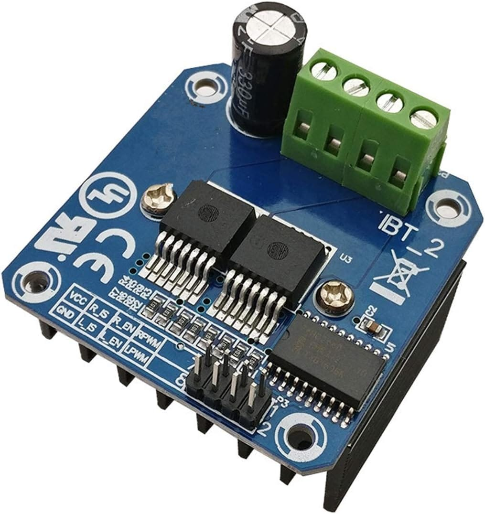
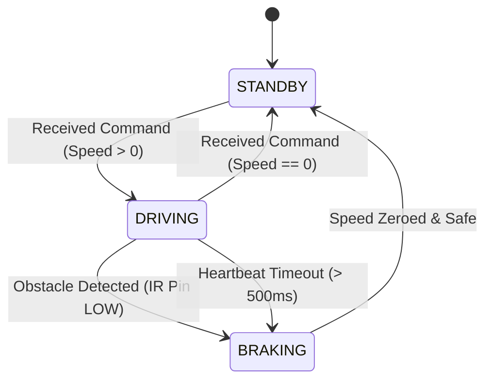

# Motor Controller Node

## Purpose
The Motor Controller Node drives the 4 Johnson 12V geared motors using two BTS7960 H-bridge drivers. It processes speed commands from the Master Node and monitors safety sensors.

## Hardware Used
*   **MCU**: ESP32-WROOM-32E.
*   **Drivers**: 2 × BTS7960 43A High-Current H-Bridge Motor Drivers — [BTS7960 Motor Driver Technical Manual](https://www.handsontec.com/dataspecs/module/BTS7960%20Motor%20Driver.pdf).
    
    

*   **Motors**: 4 × Johnson 12V 200RPM Geared DC Motors — [Johnson Geared DC Motor Specifications](https://robokits.co.in/motors/dc-motor/12v-johnson-motors/johnson-geared-dc-motors/johnson-motor-high-torque-dc-geared-12v-200rpm-grade-a?srsltid=AfmBOooiC_oSqyLvd_9NfLgiyI_Nmj8Ew9rqYHNrEijR93sJNe8nScjS).
    
    

*   **Wheels**: 4 × Robot Wheels (10cm Diameter, 4cm Width, rubber-tread).
*   **Brackets**: Heavy-duty steel motor mounting brackets.
*   **Obstacle Sensors**: 3 × E18-D80NK Adjustable Infrared Proximity Sensors (Left, Center, Right) mounted on the base chassis for collision avoidance — [E18-D80NK Datasheet Reference](https://assets.rs-online.com/v1699554953/Datasheets/39649469e922b1bb1701adf117c2afc4.pdf).

## GPIO Mapping
| GPIO | Direction | Pin Function | Target Component |
| :--- | :--- | :--- | :--- |
| **GPIO 12** | Output | Left PWM Forward (L_PWM) | Driver 1 (Left Group) |
| **GPIO 13** | Output | Left PWM Reverse (R_PWM) | Driver 1 (Left Group) |
| **GPIO 14** | Output | Left Enable (L_EN / R_EN) | Driver 1 (Left Group) |
| **GPIO 25** | Output | Right PWM Forward (L_PWM) | Driver 2 (Right Group) |
| **GPIO 26** | Output | Right PWM Reverse (R_PWM) | Driver 2 (Right Group) |
| **GPIO 27** | Output | Right Enable (L_EN / R_EN) | Driver 2 (Right Group) |
| **GPIO 34** | Input | Left Proximity Sensor (Active LOW) | Left E18-D80NK IR Sensor |
| **GPIO 35** | Input | Center Proximity Sensor (Active LOW) | Center E18-D80NK IR Sensor |
| **GPIO 39** | Input | Right Proximity Sensor (Active LOW) | Right E18-D80NK IR Sensor |

## State Machine

## Failure Cases & Recovery
*   **Failure Case 1**: Motor driver over-temperature.
    *   *Symptom*: BTS7960 active thermal protection triggers, causing the motor output to stop.
    *   *Recovery*: The Motor Node detects the loss of motion via odometry, reports a driver fault to the Master Node, disables the driver enable lines (EN pins set to LOW), and waits for the driver to cool.
*   **Failure Case 2**: Communication dropout.
    *   *Symptom*: Loss of ESP-NOW commands from the Master.
    *   *Recovery*: The watchdog timer triggers after 500 ms, pulling all PWM and EN pins to GND to engage the brakes.
