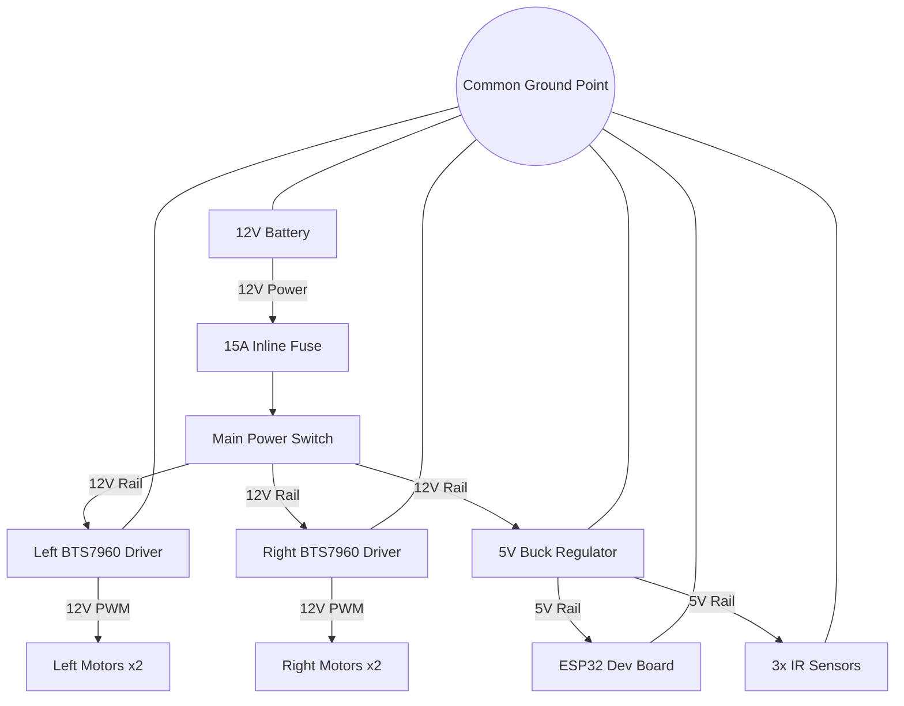
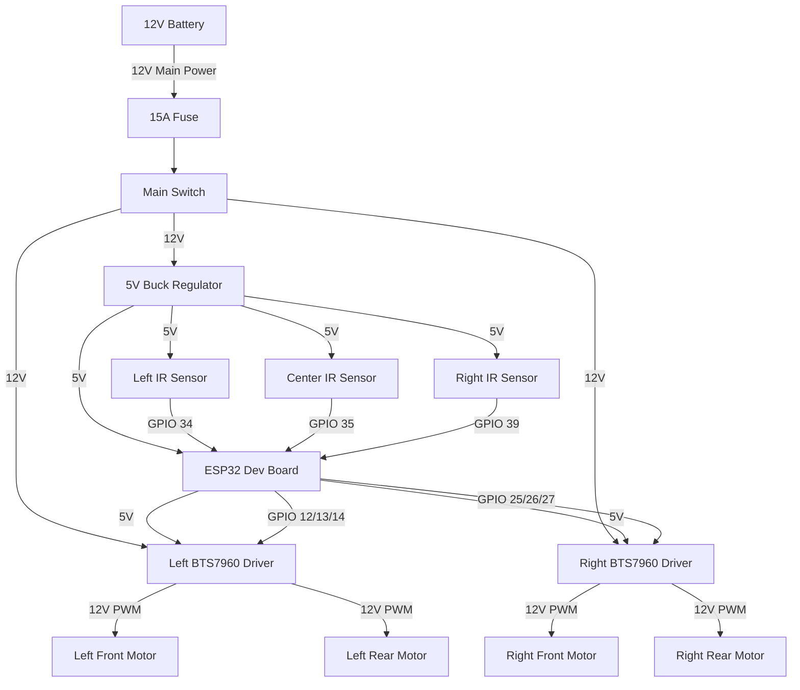

# Motor Controller Node

## 1. Overview

### Purpose of the Motor Node
The Motor Controller Node is the hardware subsystem responsible for driving the locomotion base of the PRAYAS robot. It processes motion directives and drives the wheels accordingly while monitoring localized proximity sensors to prevent physical collisions.

### What this Node Controls
*   **Motors**: Actuates the 4 wheels using H-bridge drivers.
*   **Sensors**: Interfaces with 3 infrared obstacle sensors to monitor the path immediately in front of the robot.

### Responsibilities of the Node
*   Receive directional and speed commands.
*   Translate these commands into electrical signals that control motor speed and direction.
*   Sample the infrared sensors continuously.
*   Halt all motion immediately if an obstacle is detected in the travel path.

---

## 2. Components Required

The table below lists all components required to assemble the Motor Node:

| Component Name | Quantity | Specification | Purpose |
| :--- | :---: | :--- | :--- |
| **ESP32 Dev Board** | 1 | ESP32-WROOM-32E DevKit (38 Pins) | Microcontroller that reads sensors and generates control signals. |
| **BTS7960 Motor Driver** | 2 | 43A High-Current Dual H-Bridge Module | Interfaces between ESP32 signals and high-current Johnson motors. |
| **Johnson 12V DC Motors** | 4 | 12V Nominal, 200 RPM Geared DC Motors | Electric geared motors that provide traction and drive the wheels. |
| **E18-D80NK IR Sensors** | 3 | Adjustable Range (3–80 cm), Active LOW | Proximity sensors used to detect obstacles in front of the robot. |
| **Power Input Connector**| 1 | XT60 Connector (Male/Female pair) | Connects the main 12V battery pack securely to the power lines. |
| **Screw Terminal Blocks**| Assorted| 5.08 mm Pitch PCB Screw Terminals | Allows secure, solderless cable connections for power distribution. |
| **Connecting Wires** | Assorted| 14 AWG (Power lines) / 24 AWG (Signal lines) | Carries electric current and logic signals between components. |

---

## 3. Component Description

### ESP32 Dev Board
*   **What it is**: A small, low-cost microcontroller development board with a dual-core processor and digital input/output (GPIO) pins.
*   **Why it is used**: It provides fast processing speeds, hardware timers capable of generating precise Pulse Width Modulation (PWM) signals, and has enough GPIO pins to handle the sensors and drivers.
*   **How it works inside PRAYAS**: It acts as the local brain of the Motor Node. It reads the digital states of the IR sensors and outputs the control signals (speed and direction) to the motor drivers.

### BTS7960 Motor Driver
*   **What it is**: A high-current H-bridge motor driver module designed to control a DC motor's direction and speed.
*   **Why it is used**: Johnson DC motors can draw several amperes under load. Standard motor drivers (like L298N) will overheat and fail. The BTS7960 is rated for up to 43A, providing a reliable and safe solution.
*   **How it works inside PRAYAS**: It acts as an electronic switch. It receives weak logic signals from the ESP32 and switches the high-current 12V power from the battery to the motors.

### Johnson 12V 200 RPM DC Motors
*   **What it is**: A brushed DC motor attached to a metal spur gearbox.
*   **Why it is used**: DC motors rotate too fast and have too little torque on their own to move a heavy robot. The gearbox reduces the rotation speed to 200 RPM while multiplying the torque, allowing it to easily carry the 5–7 kg weight of PRAYAS.
*   **How it works inside PRAYAS**: Four motors drive the wheels. They are wired in parallel groups (two on the left, two on the right) to run a 4-wheel-drive differential chassis.

### E18-D80NK IR Obstacle Sensors
*   **What it is**: An infrared proximity sensor that emits a beam of light and detects its reflection from nearby objects.
*   **Why it is used**: It provides cheap, reliable, and low-latency digital obstacle detection.
*   **How it works inside PRAYAS**: Three sensors are mounted on the front bumper. If an obstacle comes within the detection threshold, the sensor pulls its output pin LOW, telling the ESP32 to immediately brake the motors.

---

## 4. Circuit Connection

This section details how to connect the components of the Motor Node.

### ESP32 to BTS7960 Connections
Control signals are routed from the ESP32 to the logic inputs of the H-bridges:

| ESP32 Pin | Connected To | BTS7960 Driver | Function |
| :--- | :--- | :--- | :--- |
| **GPIO 12** | L_PWM | Left Driver (Driver 1) | Left forward speed signal (PWM) |
| **GPIO 13** | R_PWM | Left Driver (Driver 1) | Left reverse speed signal (PWM) |
| **GPIO 14** | L_EN & R_EN (Tied) | Left Driver (Driver 1) | Left driver enable control |
| **GPIO 25** | L_PWM | Right Driver (Driver 2) | Right forward speed signal (PWM) |
| **GPIO 26** | R_PWM | Right Driver (Driver 2) | Right reverse speed signal (PWM) |
| **GPIO 27** | L_EN & R_EN (Tied) | Right Driver (Driver 2) | Right driver enable control |
| **5V** | VCC | Both Drivers | Logic power supply for drivers |
| **GND** | GND | Both Drivers | Logic ground reference |

### BTS7960 to Motors Connections
Motor outputs are wired in parallel to drive the two motors on each side together:

| Driver Terminal | Connected To | Motor Group | Description |
| :--- | :--- | :--- | :--- |
| **Left Driver M+** | (+) Terminals | Left Front & Left Rear Motors | Drives the left side wheels forward |
| **Left Driver M-** | (-) Terminals | Left Front & Left Rear Motors | Drives the left side wheels backward |
| **Right Driver M+**| (+) Terminals | Right Front & Right Rear Motors | Drives the right side wheels forward |
| **Right Driver M-**| (-) Terminals | Right Front & Right Rear Motors | Drives the right side wheels backward |

### ESP32 to IR Sensors Connections
Sensors require 5V power and return digital signals to the ESP32:

| IR Sensor Module | Wire Color | ESP32 Pin | Pin Function |
| :--- | :--- | :--- | :--- |
| **Left IR Sensor** | Brown | **5V** | Power supply (+5V) |
| | Blue | **GND** | Ground |
| | Black | **GPIO 34** | Digital sensor output (Active LOW) |
| **Center IR Sensor** | Brown | **5V** | Power supply (+5V) |
| | Blue | **GND** | Ground |
| | Black | **GPIO 35** | Digital sensor output (Active LOW) |
| **Right IR Sensor**| Brown | **5V** | Power supply (+5V) |
| | Blue | **GND** | Ground |
| | Black | **GPIO 39** | Digital sensor output (Active LOW) |

### Power Supply Connections
Power routing from the battery to the drivers and the microcontroller:

| From Source | Connection | To Destination | Wire Gauge | Description |
| :--- | :--- | :--- | :---: | :--- |
| **Battery (+)** | XT60 Connector | 15A Inline Fuse → Switch | 14 AWG | Main battery positive feed |
| **Switch Output**| Split to 3 paths | Left Driver B+, Right Driver B+, Regulator Input (+) | 14 AWG / 22 AWG | Switched 12V power |
| **Battery (-)** | XT60 Connector | Common Ground Point | 14 AWG | Main battery negative reference |
| **Common Ground**| Split to 3 paths | Left Driver B-, Right Driver B-, Regulator Input (-) | 14 AWG / 22 AWG | Ground distribution |
| **Regulator Out (+)**| Red Wire | ESP32 Vin / 5V Pin | 22 AWG | Regulated 5V logic supply |
| **Regulator Out (-)**| Black Wire | ESP32 GND Pin | 22 AWG | Logic ground return |

---

## 5. GPIO Connection Table

The table below lists all ESP32 pins used in this node:

| GPIO | Connected To | Pin Mode | Purpose | Safe Boot Handling |
| :--- | :--- | :---: | :--- | :--- |
| **GPIO 12** | Left Driver L_PWM | Output | Left forward speed (PWM) | **Boot Strap Pin (MTDI)**: Must be LOW at boot. The H-bridge's internal pull-down keeps this safe. |
| **GPIO 13** | Left Driver R_PWM | Output | Left reverse speed (PWM) | Safe to use. |
| **GPIO 14** | Left Driver EN | Output | Left driver enable control | Safe to use. |
| **GPIO 25** | Right Driver L_PWM | Output | Right forward speed (PWM) | Safe to use. |
| **GPIO 26** | Right Driver R_PWM | Output | Right reverse speed (PWM) | Safe to use. |
| **GPIO 27** | Right Driver EN | Output | Right driver enable control | Safe to use. |
| **GPIO 34** | Left IR Proximity Out | Input | Left obstacle sensor input | Input-only pin. Requires pull-up. |
| **GPIO 35** | Center IR Proximity Out| Input | Center obstacle sensor input | Input-only pin. Requires pull-up. |
| **GPIO 39** | Right IR Proximity Out | Input | Right obstacle sensor input | Input-only pin. Requires pull-up. |
| **GPIO 2** | Onboard LED | Output | Status indicator (blinking) | **Boot Strap Pin**: Must be LOW or floating at boot. |

---

## 6. Power Distribution

### Power Flow Principles
*   **Battery Input**: The robot runs on a 12V Li-Ion battery pack. It is connected to the system using a high-current XT60 connector.
*   **Voltage used by Motors**: The 4 Johnson DC motors are powered directly by the 12V battery rail through the BTS7960 drivers to maximize torque.
*   **Voltage used by ESP32**: The ESP32 cannot handle 12V directly. A 5V DC-to-DC buck regulator steps down the 12V battery power to 5V, which is fed into the ESP32 Vin pin.
*   **Voltage used by Sensors**: The E18-D80NK IR proximity sensors require 5V to power their internal optical circuits. They are wired to the 5V output of the buck regulator.
*   **Common Ground**: The negative terminals of the battery, H-bridges, 5V regulator, ESP32 ground pins, and IR sensors must all be connected to a single point. This ensures a stable reference voltage for all logic signals.

### Power Flow Diagram


---

## 7. Working Principle

The step-by-step operation of the Motor Node is described below:

```
  [ Power ON ]
       │
       ▼
  [ ESP32 Boots ] ──> Sets Pin Modes (LEDC outputs and Sensor inputs)
       │
       ▼
  [ Drivers Init ] ──> Sets Enables HIGH and Speed PWM to 0%
       │
       ▼
  [ Sensors Init ] ──> Emitters start transmitting IR beams
       │
       ▼
  [ Wait for Command ] ◄── Incoming directives (Forward, Turn, Stop)
       │
       ├─────────────────────────────────┐
       ▼                                 ▼
  [ Command Received ]            [ Timeout Check ] ──> Halt if no cmd for 500ms
       │
       ▼
  [ Check Obstacle ]
       │
       ├── Obstacle Detected (Any IR pin LOW) ──> Force Motor Speed to 0% (E-Stop)
       │
       └── Path Clear (All IR pins HIGH)
               │
               ▼
          [ Drive Motors ] ──> Apply PWM to target H-bridges
               │
               ▼
          [ Send Status ] ──> Loops back to wait for next command
```

---

## 8. Motor Functions

Locomotion is controlled by varying the speed and direction of the left and right motor groups:

*   **Forward**: The ESP32 drives the forward PWM pins (GPIO 12 and 25) HIGH. Both the left and right motor groups spin forward at the same speed.
*   **Backward**: The ESP32 drives the reverse PWM pins (GPIO 13 and 26) HIGH. Both motor groups spin backward.
*   **Left**: The left motor group spins backward (GPIO 13 HIGH) and the right group spins forward (GPIO 25 HIGH), pivoting the robot left.
*   **Right**: The right motor group spins backward (GPIO 26 HIGH) and the left group spins forward (GPIO 12 HIGH), pivoting the robot right.
*   **Rotate Left**: Spins the left wheels backward and right wheels forward at equal speeds to rotate the robot on its center axis.
*   **Rotate Right**: Spins the left wheels forward and right wheels backward at equal speeds.
*   **Stop**: The ESP32 sets all PWM outputs to 0. The H-bridge driver shorts the motor leads to ground to engage dynamic braking.
*   **Variable Speed**: Achieved by adjusting the PWM Duty Cycle (0% to 100%). By switching the 12V supply ON and OFF at a high frequency (20 kHz), the average voltage delivered to the motors changes, providing smooth speed control.

---

## 9. Obstacle Detection

The collision avoidance system uses 3 IR proximity sensors mounted on the front edge of the plywood chassis:

*   **Left Sensor**: Angled outward at $30^\circ$. It monitors the front-left travel zone.
*   **Center Sensor**: Mounted straight forward ($0^\circ$). It monitors the direct path of travel.
*   **Right Sensor**: Angled outward at $30^\circ$. It monitors the front-right travel zone.

### Obstacle Trigger Logic Table
When a sensor detects an object within its adjusted range, its signal output goes LOW. The robot reacts as follows:

| Left Sensor | Center Sensor | Right Sensor | Detection Zone | Robot Reaction |
| :---: | :---: | :---: | :---: | :--- |
| HIGH | HIGH | HIGH | Clear | Travel normally |
| **LOW** | HIGH | HIGH | Left Obstacle | Halt forward travel. Rotate right to clear. |
| HIGH | **LOW** | HIGH | Center Obstacle | Halt travel immediately. Reverse, then pivot away. |
| HIGH | HIGH | **LOW** | Right Obstacle | Halt forward travel. Rotate left to clear. |
| **LOW** | **LOW** | **LOW** | Trap | Halt immediately. Lock out forward motion. |

---

## 10. Wiring Diagram

The diagram below shows the electrical interconnections of the Motor Node:



---

## 11. Notes

### Wiring Tips
*   **Noise Reduction**: Twist the positive (+) and negative (-) wires of each motor group together. This reduces electromagnetic interference (EMI) that can cause the ESP32 to reset.
*   **Cable Routing**: Route signal cables (IR sensors and PWM) away from the high-current 12V motor cables. If they must cross, route them perpendicular to each other.

### Cable Management
*   **Strain Relief**: Use zip ties to secure cables to the plywood base. Ensure there is no strain on the solder joints or screw terminals.
*   **Color Coding**: Use standard colors (Red for Power, Black for Ground, and other colors for signals) to simplify assembly and debugging.

### Safety Precautions
*   **Fuse Protection**: Never run the system without the **15A inline fuse** installed on the battery positive cable. A short circuit on a Li-Ion battery can cause fire or explosion.
*   **Power Down**: Always disconnect the battery before plugging in or unplugging components or wiring changes.

### Testing Before Power On
*   **Short Circuit Check**: Use a multimeter in Continuity Mode to verify there is no direct path between 12V and Ground before connecting the battery.
*   **Traction Test**: Place the robot chassis on a stand so the wheels can spin freely before turning on the power for the first time. This prevents the robot from driving off the table if the motors are wired backward.
