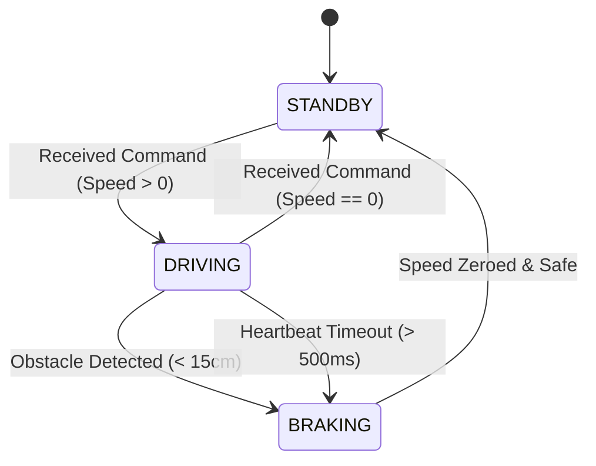

# Motor Controller Node

## Purpose
The Motor Controller Node drives the 4 Johnson 12V geared motors using two BTS7960 H-bridge drivers. It processes speed commands from the Master Node and monitors safety sensors.

## Hardware Used
*   **MCU**: ESP32-WROOM-32E.
*   **Drivers**: 2 × BTS7960 43A High-Current H-Bridge Motor Drivers.
*   **Motors**: 4 × Johnson 12V 200RPM Geared DC Motors.

## GPIO Mapping
| GPIO | Direction | Pin Function | Target Component |
| :--- | :--- | :--- | :--- |
| **GPIO 12** | Output | Left PWM Forward (L_PWM) | Driver 1 (Left Group) |
| **GPIO 13** | Output | Left PWM Reverse (R_PWM) | Driver 1 (Left Group) |
| **GPIO 14** | Output | Left Enable (L_EN / R_EN) | Driver 1 (Left Group) |
| **GPIO 25** | Output | Right PWM Forward (L_PWM) | Driver 2 (Right Group) |
| **GPIO 26** | Output | Right PWM Reverse (R_PWM) | Driver 2 (Right Group) |
| **GPIO 27** | Output | Right Enable (L_EN / R_EN) | Driver 2 (Right Group) |
| **GPIO 34** | Input | Front Ultrasonic Echo | HC-SR04 Sensor |
| **GPIO 35** | Output | Front Ultrasonic Trigger| HC-SR04 Sensor |

## State Machine

## Failure Cases & Recovery
*   **Failure Case 1**: Motor driver over-temperature.
    *   *Symptom*: BTS7960 active thermal protection triggers, causing the motor output to stop.
    *   *Recovery*: The Motor Node detects the loss of motion via odometry, reports a driver fault to the Master Node, disables the driver enable lines (EN pins set to LOW), and waits for the driver to cool.
*   **Failure Case 2**: Communication dropout.
    *   *Symptom*: Loss of ESP-NOW commands from the Master.
    *   *Recovery*: The watchdog timer triggers after 500 ms, pulling all PWM and EN pins to GND to engage the brakes.
