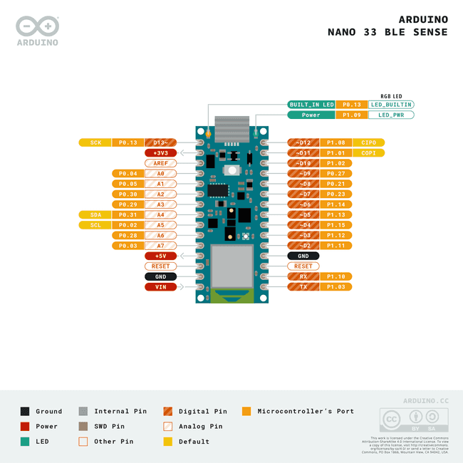

# Sensor Node

## Purpose
The Sensor Node collects environmental and inertial data to help the robot monitor its physical state and navigate safely.

## Hardware Used
*   **MCU**: Arduino Nano 33 BLE Sense (featuring a Nordic nRF52840 Cortex-M4 CPU) — [Arduino Nano 33 BLE Sense Cheat Sheet](https://docs.arduino.cc/tutorials/nano-33-ble-sense/cheat-sheet/).
    
    { style="display: block; margin: 0 auto;" width="300" }

*   **IMU**: LSM9DS1 (9-axis inertial measurement unit).
*   **On-board Telemetry Sensors**: HTS221 (Temperature & Humidity), LPS22HB (Barometric Pressure), APDS9960 (Gesture, light, color).

## GPIO Mapping
| GPIO Pin | Pin Function | Target Component |
| :--- | :--- | :--- |
| **I2C SCL** | I2C Clock | Internal LSM9DS1 (IMU) / Sensors |
| **I2C SDA** | I2C Data | Internal LSM9DS1 (IMU) / Sensors |
| **Tx / D1** | UART Serial Transmit | Master Node GPIO 35 (or ESP-NOW) |

## Data Flow
```
 [ IMU / HTS221 / APDS9960 ] ──(I2C)──> [ Nano 33 BLE ] ──(UART / ESP-NOW)──> [ Master Node ]
```

## Failure Cases & Recovery
*   **Sensor Frozen (I2C Lockup)**: If the IMU fails to update for more than 5 consecutive cycles, the Nano 33 BLE triggers a software reset (`NVIC_SystemReset()`) to re-initialize the I2C bus.
