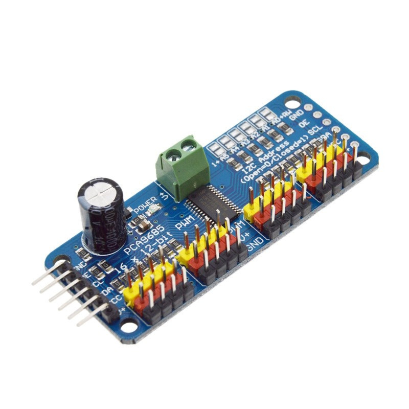
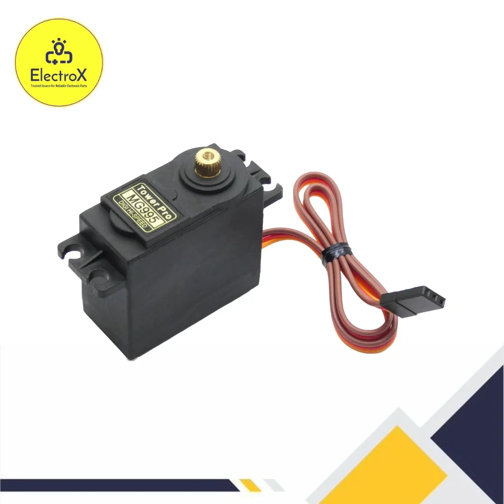
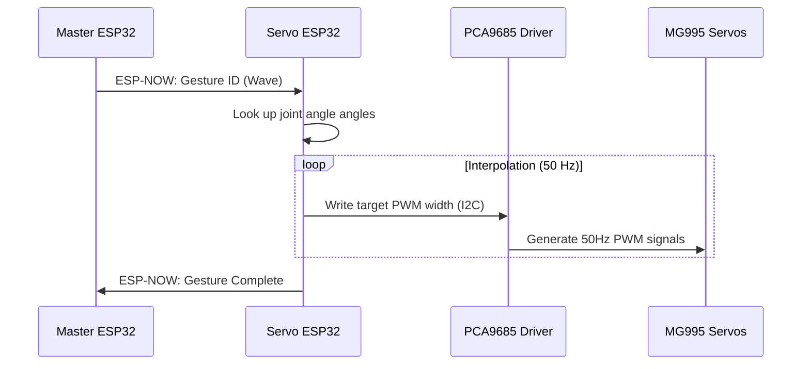

# Servo Controller Node

## Purpose
The Servo Controller Node manages the angular positions and motion profiles of the 7 TowerPro MG995 servos via a PCA9685 16-channel I2C PWM driver.

## Hardware Used
*   **MCU**: ESP32-WROOM-32E.
*   **PWM Driver**: PCA9685 16-Channel 12-bit I2C PWM controller — [Adafruit PCA9685 Guide & Datasheet](https://cdn-learn.adafruit.com/downloads/pdf/16-channel-pwm-servo-driver.pdf).
    
    { style="display: block; margin: 0 auto;" width="320" }

*   **Servos**: 7 × TowerPro MG995 Analog Metal Gear Servos — [TowerPro MG995 Datasheet Reference](https://www.electronicoscaldas.com/datasheet/MG995_Tower-Pro.pdf).
    
    { style="display: block; margin: 0 auto;" width="320" }

## GPIO Mapping
| GPIO | Pin Function | Target Component |
| :--- | :--- | :--- |
| **GPIO 21** | I2C Serial Data (SDA) | PCA9685 SDA (with 4.7k pull-up) |
| **GPIO 22** | I2C Serial Clock (SCL) | PCA9685 SCL (with 4.7k pull-up) |
| **GPIO 19** | Hardware Output Enable (OE)| PCA9685 OE Pin (active LOW) |

### PCA9685 Channel Assignments
*   **Channel 0**: Head Neck Yaw (MG995)
*   **Channel 1**: Left Shoulder Pitch (MG995)
*   **Channel 2**: Left Elbow Pitch (MG995)
*   **Channel 3**: Left Wrist Roll (MG995)
*   **Channel 4**: Right Shoulder Pitch (MG995)
*   **Channel 5**: Right Elbow Pitch (MG995)
*   **Channel 6**: Right Wrist Roll (MG995)

## Sequence Diagram

## Failure Cases & Recovery
*   **Servo Jitter/Brownout**: Occurs when multiple servos draw power simultaneously, causing a temporary voltage drop on the 6V rail.
    *   *Solution*: The logic rail is fully isolated from the servo power rail. A large 4700µF capacitor is installed across the PCA9685 servo power terminal block to absorb peak current demands.
