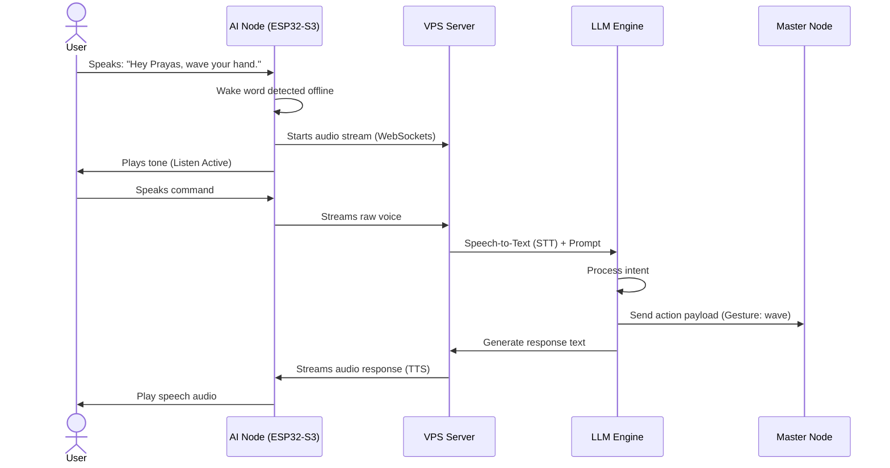

# Conversation System Flow

## Purpose
This document details the conversation pipeline, explaining how natural language is converted into actions and audio feedback.

## Conversational Pipeline Flow
The conversation system processes audio in five distinct stages:

## Performance Targets
*   **Wake Word Detection**: Done locally on the ESP32-S3 in under 150 ms.
*   **Speech-to-Text (STT) & LLM Response**: Under 800 ms.
*   **Text-to-Speech (TTS) Generation**: Streaming playback begins within 400 ms of receiving text.
