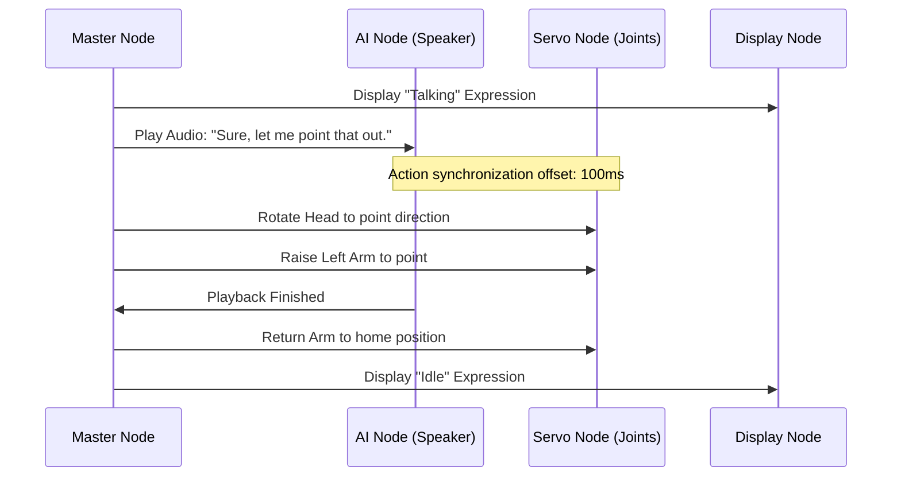

# Robot Action Execution Engine

## Purpose
This document describes the Action Execution Engine, which coordinates physical movements, speech responses, and expressions.

## Coordinated Actions
The robot can coordinate movements, speech, and expressions to make interactions feel more natural.

## Failure Recovery
If an arm servo becomes overloaded or stuck during an action, it sends a telemetry alert. The Master Node then halts the current action, returns the arm to a safe position, and uses the text-to-speech system to notify the user.
