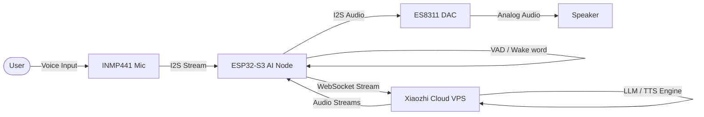

# Voice Assistant Overview

## Purpose
This document describes the voice assistant configuration of PRAYAS V1, outlining the audio pipeline and natural language interaction flow.

## Architecture
The voice assistant runs on the AI Node (ESP32-S3) using the **Xiaozhi Voice Framework**. It captures audio using a microphone array, performs wake word detection, sends the voice stream to a local or cloud LLM, and plays back the speech response through a DAC and speaker.

