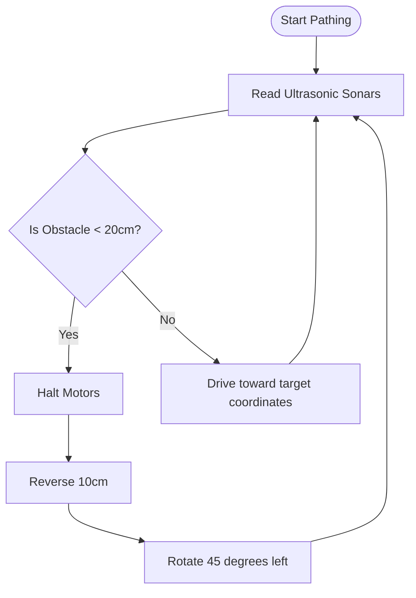

# Autonomous Locomotion & Pathing

## Purpose
This document details the autonomous locomotion, path planning, and obstacle avoidance systems of PRAYAS V1.

## Obstacle Avoidance Flowchart
Locomotion tasks default to a safety-monitored behavior:

## Odometry & Path Tracking
*   **Open-Loop Target Pathing**: In V1, the robot estimates its position using wheel rotation duration and velocity profiles.
*   **Odometry Limitations**: Without wheel encoders, slippage on smooth floors can cause positioning errors (drift) of up to 15% over a 5-meter drive.
