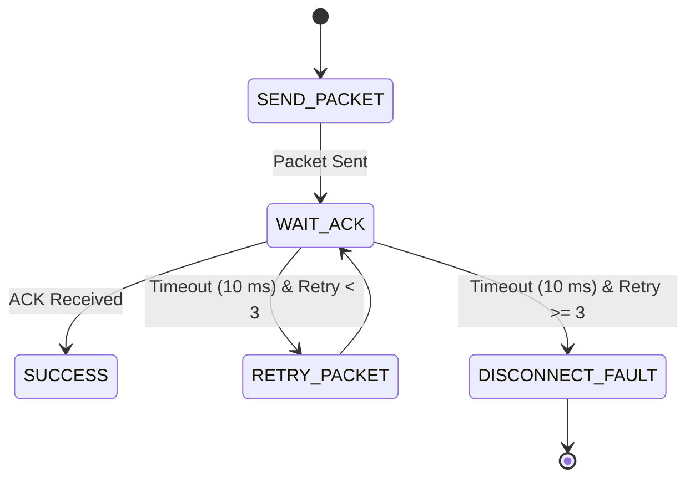

# Transmission Retry System

## Purpose
This document details the transmission retry logic used to ensure reliable delivery of critical commands.

## ESP-NOW Transmission Verification
Unlike standard Wi-Fi, ESP-NOW does not establish a persistent connection. To ensure critical packets (like gesture triggers or state changes) are delivered, the Master Node uses a confirm-and-retry mechanism:

