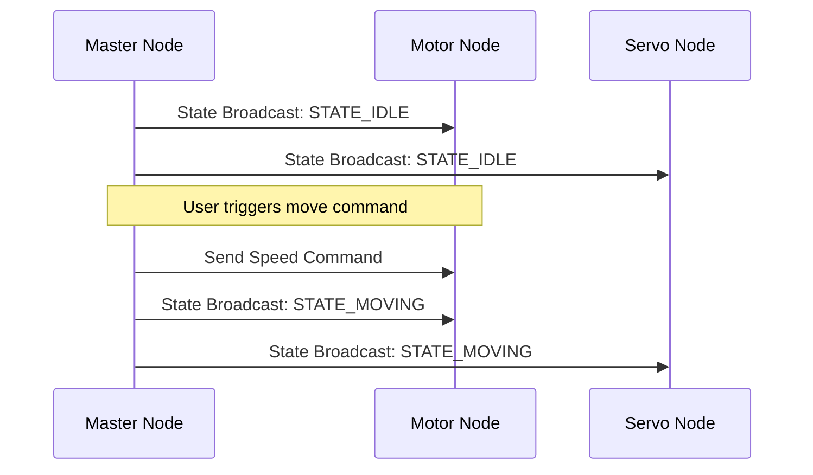

# State Synchronization

## Purpose
This document describes the state synchronization mechanism, which ensures all nodes have a consistent view of the robot's current state.

## State Synchronization Flow
To prevent inconsistent states (such as the robot trying to drive while in a calibration mode), the Master Node maintains the master state and periodically broadcasts it to all sub-nodes:

