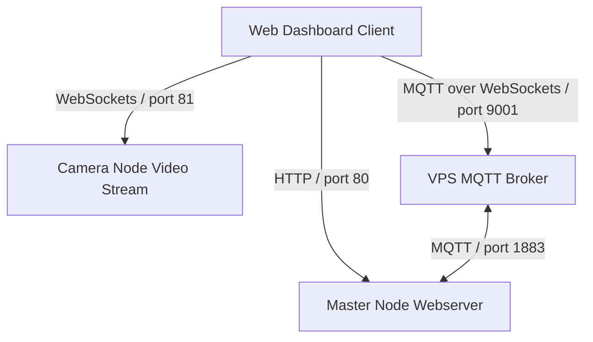

# Web Dashboard Overview

## Purpose
This document details the layout, styling, and framework integration of the PRAYAS Web Dashboard.

## UI Architecture
The PRAYAS Web Dashboard is built as a single-page web application using core HTML5, CSS3 (Vanilla), and JavaScript. It provides a visual interface for managing telemetry, camera feeds, logs, and manual controls.

