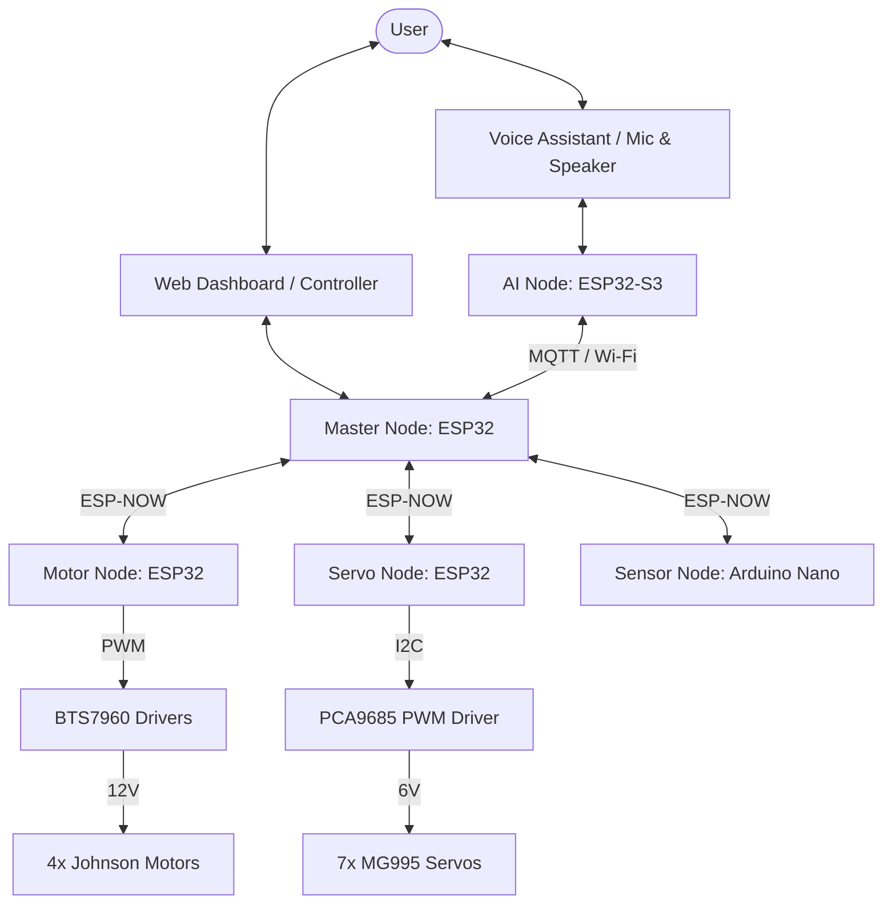

# PRAYAS V1 Humanoid Robot: Engineering Knowledge Base

Welcome to the official, production-grade engineering documentation for **PRAYAS V1** (Personal Robotic Assistant for Your Active Support). 

PRAYAS is an open-source, modular humanoid upper-body robot mounted on a motorized differential drive base. Designed for indoor assistance, research, and interactive operations, the platform utilizes a **Distributed ESP32 Node Architecture** linked via low-latency ESP-NOW and MQTT wireless protocols, integrated with an AI Node running the Xiaozhi Voice Framework and Model Context Protocol (MCP).

## System Overview

*   **Chassis & Frame**: 12mm plywood base deck, 70cm height 4-inch PVC column torso, 3D printed PETG/PLA+ arm joints, and a lightweight sunboard base cover.
*   **Drivetrain**: 4 × Johnson 12V 200 RPM metal gear motors operating in differential drive configuration via dual 43A BTS7960 H-bridges.
*   **Actuation**: 7 × MG995 metal gear servos (1 neck yaw/pitch, 3 per arm for shoulder, elbow, wrist) providing multi-DOF human-like gestures.
*   **AI & Interaction**: Voice conversational pipeline powered by Xiaozhi Framework, supporting offline wake words, low-latency Speech-to-Text (STT), cloud Large Language Model (LLM) processing, and Text-to-Speech (TTS) response.
*   **Power System**: 3S 6800 mAh Lithium battery (~11.1V - 12.6V) with high-efficiency buck converters providing isolated 6V servo and 5V/3.3V logic rails.

## Documentation Structure

The documentation is organized as follows:

1.  **01 Project Overview**: Vision, roadmap, design goals, and engineering philosophy.
2.  **02 System Architecture**: High-level block diagrams, node coordination, and power flow layouts.
3.  **03 Hardware Architecture**: In-depth hardware selection, CAD concepts, node schematics, and the Bill of Materials (BOM).
4.  **04 Software & Firmware**: FreeRTOS task schedules, libraries, OTA system, and error recovery policies.
5.  **05 AI System**: Conversational flow, Xiaozhi voice assistant, MCP integration, and computer vision.
6.  **06 Control System**: Control arbitration priority, gamepad inputs, voice actions, and motor/servo tuning.
7.  **07 Mechanical Design**: Physical dimensions, joint angles, 3-DOF kinematic analysis, and structural assembly.
8.  **08 Electrical System**: Wiring schemas, power budgets, wire gauges, and circuit protection.
9.  **09 Communication Protocol**: ESP-NOW direct messages, MQTT topics, and JSON schemas.
10. **10 Web Dashboard**: Telemetry dashboard, remote control panel, system logs, and live video stream.
11. **11 Testing & Diagnostics**: Comprehensive test plans for motor drivers, servo PWMs, and stress testing.
12. **12 Manufacturing & Upgrades**: 3D printing slicing configurations, assembly order, calibration, and future roadmap.
